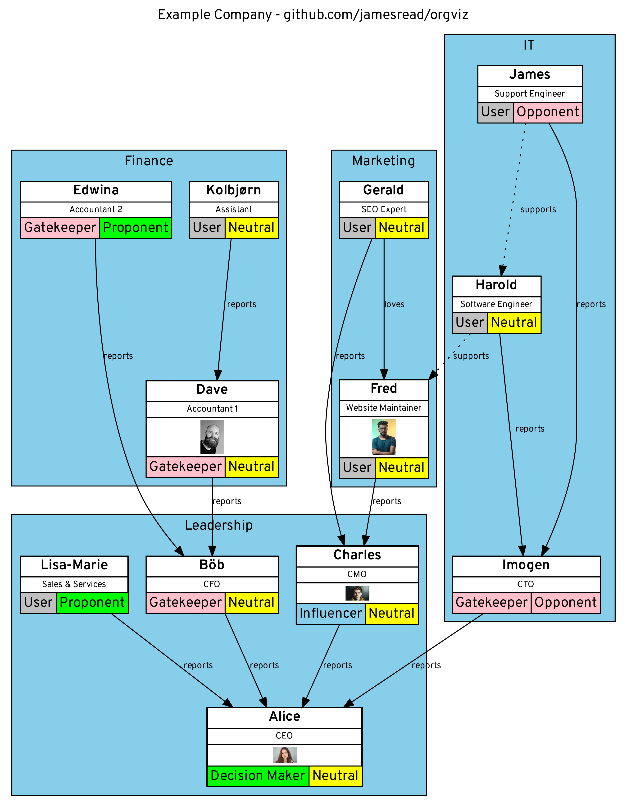

orgviz
======

A tool to visualize the "real" structure of organizations.



On a technical level, this tool basically parses a high level text based language, which is compiled to the amazing GraphViz `dia` program language. It provides extra constructs and ease of use for drawing complex org charts (graphs!). 

Installation
---

This tool has been tested on Fedora 30, but will almost certainly work on any
Linux with python3 and Graphviz installed. If Mac's have Graphviz, then it
should work on a Mac just fine.

If using this tool from source, the following packages are required; 

- GraphViz's `dot`
- `python3`

The following python3 libraries are also required; 

- `python3-configargparse` (note, not just `argparse`)

Usage
-----

`./orgviz.py -I <inputfile>`

`./orgviz.py --help`


Organization (Input) File Formal Syntax
----

```
Full Name
    supports -> Full Name
    reports -> Full Name
    influence: <enemy, supporter, promoter>
    team: Team Name
    title: Job Title
```

For the example input file that makes up the screenshot above, please see the [examples directory](examples/).

Configuration File
----

If you get tired of specifying command line options, then create
`~/.orgviz.conf` and pop your options in there to save time.
